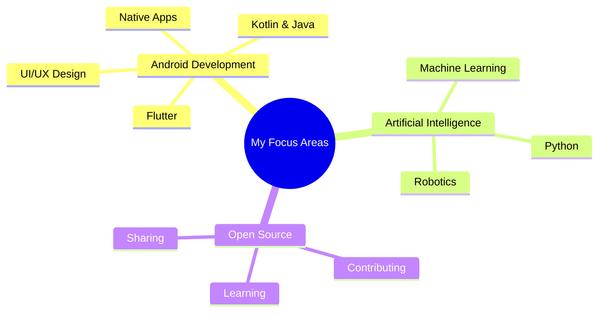
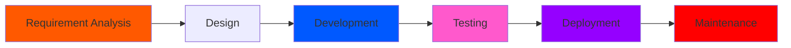

<div align="center"> 
   
</div>

<div align="center">
  
</div>

<div align="center">
  
  <a href="https://komarev.com/ghpvc/?username=mahimaverma25">
    
  </a>
</div>

---

## 👋 Introduction | FullStack Developer

I'm Mahima Verma, a passionate FullStack developer currently pursuing a BCA at the University of Allahabad. 
I specialize in building websites using HTML, CSS, JS Node.js, Express.js, React.js, MongoDb, etc. And
also exploring AI/ML with Python and Its libraries. And In Future I also want to learn and explore about Robotics and it's technology.

---

## 🚀 What I Do 

- 🌐 **Web Development** using HTML/CSS/JS for responsive interfaces
- 🎨 **UI/UX Design** with fullStack Development, website Design and many more
- 📱 **Flutter Development** - cross-platform apps for iOS, Android, and Web
- 🤖 **AI/ML Integrations** using Python and its libraries for smart app features
- 📂 **Version Control** with Git & GitHub for collaborative development and open source

---

<div style="background: linear-gradient(45deg, #12c2e9, #c471ed, #f64f59); padding: 20px; border-radius: 10px; margin: 20px 0;">


## 💻 Tech Stack & Tools | APP & Web Development
<p align="center">
  
</p>

<div align="center" style="transform-style: preserve-3d; perspective: 1000px;">
  <table align="center" style="transform: rotateX(10deg); box-shadow: 0 10px 30px rgba(0,0,0,0.3); border-radius: 15px; background: rgba(255,255,255,0.1); backdrop-filter: blur(10px);">
    <tr style="transition: all 0.3s ease;">
      <td align="center" width="96" style="padding: 20px; transition: transform 0.3s ease;">
        <div style="transform-style: preserve-3d; transition: transform 0.3s ease;">
          
          <br><span style="font-weight: bold; color: #ffffff; text-shadow: 2px 2px 4px rgba(0,0,0,0.3);">Java</span>
        </div>
      </td>
      <td align="center" width="96" style="padding: 20px;">
        <div style="transform-style: preserve-3d;">
          
          <br><span style="font-weight: bold; color: #ffffff; text-shadow: 2px 2px 4px rgba(0,0,0,0.3);">Python</span>
        </div>
      </td>
      <td align="center" width="96" style="padding: 20px;">
        <div style="transform-style: preserve-3d;">
          
          <br><span style="font-weight: bold; color: #ffffff; text-shadow: 2px 2px 4px rgba(0,0,0,0.3);">GitHub</span>
        </div>
      </td>
      <td align="center" width="96" style="padding: 20px;">
        <div style="transform-style: preserve-3d;">
          
          <br><span style="font-weight: bold; color: #ffffff; text-shadow: 2px 2px 4px rgba(0,0,0,0.3);">MySQL</span>
        </div>
      </td>
    </tr>
  </table>
</div>

</div>

## :man_technologist: About Me | FullStack Developer
> - 🔭 Working on exciting **cross-platform Web applications** and exploring AI integration
> - 💬 Ask me about **Java, Web Developemnt, Python, git and github**
> - ✨ Passionate about **Android App Development** and **Robotics** & **EthicalHacking**
> - 📱 Focused on creating **seamless user experiences** across multiple platforms
> - ⚡ Fun fact: I think I am good at sleeping 😴, cooking 🍳, and watching k-dramas👀🫣


## 💻 Tech Stack | Mobile & Web Development Skills
-which I have worked with or just hands-on

| 🗂️ Categories | ⚙️ Tools & Skills |
|--------------|------------------|
| 🧑‍💻 Languages |       |
| 🤖 AI / ML |     |
| 📚 Frameworks / Libraries |    
| 🛢️ Database |   
| 🧑‍💻 IDEs |    |
| 🎓 Education |    |
| 🖥️ Operating Systems |    |
| ☁️ Hosting / SaaS |   |
| 📈 Version Control |   |
| 🚀 CI / CD |  |


## 📫 How to reach me | Contact Information

[](mailto:work.mahimaverma@gmail.com)
[](https://github.com/mahimaverma25)
  
***

## 📱 My Social Handles | Connect with Me


[](https://www.linkedin.com/in/mahima-verma-2887022a0)
[](https://www.instagram.com/mahipatel3675/)

## 📊 My Github Stats | Developer Metrics
| Stats                                                                                                                                                                                                      | Stats                                                                                                                                                                                                                                        |
| ---------------------------------------------------------------------------------------------------------------------------------------------------------------------------------------------------------- | -------------------------------------------------------------------------------------------------------------------------------------------------------------------------------------------------------------------------------------------- |
|  |  |
|        |                                                                                                       | 

## 🎯 Current Focus



## 🤝 Open for Collaboration
- 🚀 Looking to collaborate on Android Development projects
- 💡 Interested in AI/ML integrations
- 🌟 Open to mentoring and being mentored
- 🎯 Seeking opportunities in open source

## 🤝 Contribution Guidelines
If you're interested in contributing to any of my projects, here's how you can help:

1. **Fork the repository** you're interested in
2. **Create a feature branch**: `git checkout -b feature/amazing-feature`
3. **Make your changes** and test thoroughly
4. **Commit your changes**: `git commit -m 'Add some amazing feature'`
5. **Push to the branch**: `git push origin feature/amazing-feature`
6. **Open a Pull Request** and describe your changes in detail

I welcome contributions in:
- 💻 Code improvements and bug fixes
- 🎨 UI/UX enhancements
- ✅ Test coverage
- 💡 New feature ideas

Feel free to reach out if you have any questions or need guidance!

## 🎮 When I'm Not Coding
- 👀 Watching tech blogs 
- 📚 reading novels and stories
- 🎧 Music & Podcasts


## 🛠️ Development Workflow


## 💻 Workspace Setup
<div align="center">

```text
💻 Machine: HP
⚙️ OS: Windows 11 
🚀 IDE: Android Studio, VS Code
🛠️ Setup: Dual Monitor
```
</div>


